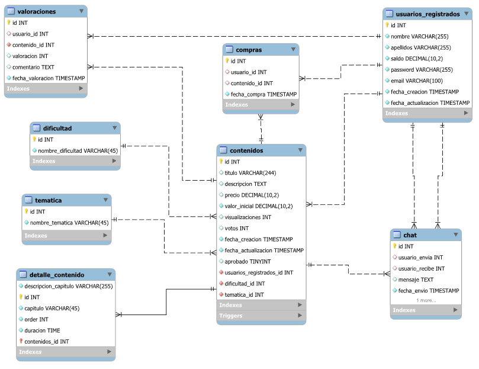

# U-KNOW: La plataforma de aprendizaje cooperativo

## Integrantes 

- [@angela-gm](https://github.com/Angela-GM)
- [@AnaPozo](https://github.com/AnaPozo)
- [@teresamadridejos](https://github.com/teresamadridejos)

## Descripción

Diseño y creación de la base de datos que conformará U-KNOW. 

Se trata de una **base de datos relacional** que organiza los datos en **8 tablas** a través de **claves primarias y claves externas**. 

Realizada con **MySQL** y **MYSQL WorkBench**.

La tabla de **contenidos** es la tabla principal del esquema, en la que se almacenaría la información de cada curso disponible en la plataforma. Incluye las siguientes columnas: 
- Id (llave primaria)
- Título del curso
- Descripción
- Dificultad
- Temática
- Precio: inicia en 1000 knowlitos por defecto.
- Valor inicial:
- Visualizaciones
- Votos
- Fecha de creación
- Fecha de actualización: se actualiza automáticamente con la fecha y hora actual cada vez que se modifica el curso.
- Aprobado
- Usuarios registrados en ese curso

La tabla tiene un **trigger** que comprueba si el valor de 'visualizaciones' o 'votos' ha cambiado. Si al menos uno de los valores ha cambiado, se realiza una actualización en el campo 'precio'. El nuevo valor del campo 'precio' se calcula sumando el 'valor_inicial', 'votos' y 'visualizaciones'.

La tabla de contenidos está relacionada, por un lado, con la tabla de **dificultad** y la tabla de **temática**. También con una tabla llamada **detalle_contenido** que contiene detalles más específicos del curso.

La tabla de contenidos se relaciona con la tabla de **valoraciones**, que incluye:
- Id (llave primaria)
- Id del usuario que realiza el comentario  (clave foránea)
- Id del contenido (clave foránea)
- Valoración
- Comentario
- Fecha de valoración

La tabla de valoraciones y la de contenidos se relacionan con la de **usuarios_registrados**. Esta contiene los siguientes campos:
- Id (llave primaria)
- Nombre
- Apellidos
- Saldo del usuario: cantidad de knowlitos que tiene
- Contraseña
- Email
- Fecha de creación de 
- Fecha de actualización

La tabla de usuarios y la de contenidos se relacionan, por un lado, con la tabla de **compras** y, por otro lado, con la tabla de **chat**.
 

